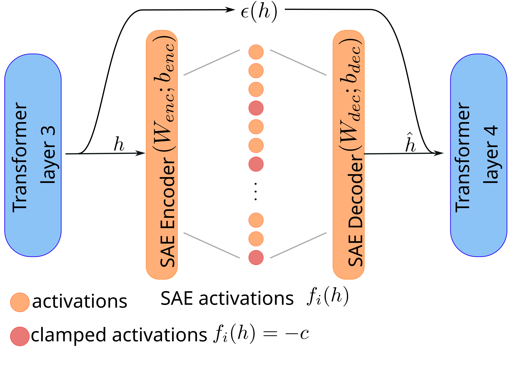

# Dynamic SAE Guardrails

Official implementation of "SAEs Can Improve Unlearning: Dynamic Sparse Autoencoder Guardrails for Precision Unlearning in LLMs" (COLM 2025)



## Overview

Dynamic SAE Guardrails is a novel approach for targeted knowledge unlearning in language models using Sparse Autoencoders (SAEs). Unlike static feature ablation, our method dynamically intervenes only when feature activation patterns exceed specified thresholds, preserving model capabilities while effectively removing unwanted knowledge.

### Key Features
- **Dynamic intervention**: Activates only when necessary, minimizing impact on general capabilities
- **Precision unlearning**: Achieves state-of-the-art results on WMDP benchmarks
- **Minimal side effects**: Maintains >99% performance on MMLU while unlearning targeted knowledge

### Supported Datasets
- **WMDP (Weapons of Mass Destruction Proxy)**: Full unlearning evaluation for bio/cyber hazardous knowledge
- **MUSE (Machine Unlearning Six-dataset Ensemble)**: Feature identification for books/news datasets


## Setup

### Requirements

- Python 3.8+
- NVIDIA GPU with 80GB+ memory (A100 recommended)
- PyTorch 2.0+

### Data Prerequisites

For WMDP bio evaluation:
1. Request the forget corpus from [this form](https://docs.google.com/forms/d/e/1FAIpQLSdnQc8Qn0ozSDu3VE8HLoHPvhpukX1t1dIwE5K5rJw9lnOjKw/viewform)
2. Place `bio-forget-corpus.jsonl` in `dynamic_sae_guardrails/evals/unlearning/data/`

For WMDP cyber evaluation, the corpus is automatically downloaded from HuggingFace.

### Installation

```bash
# Clone the repository
git clone https://github.com/aashiqmuhamed/DynamicSAEGuardrails.git
cd DynamicSAEGuardrails

# Install in editable mode
pip install -e ./dynamic_sae_guardrails
```

## Usage

### WMDP Unlearning Evaluation

Evaluate unlearning performance on WMDP bio/cyber datasets:

```bash
python dynamic_sae_guardrails/evals/unlearning/main.py \
    --sae_regex_pattern "gemma-scope-2b-pt-res" \
    --sae_block_pattern "layer_3/width_16k/average_l0_142" \
    --model_name gemma-2-2b-it \
    --llm_batch_size 1 \
    --llm_dtype float32 \
    --force_rerun \
    --random_seed 0 \
    --case bio  # or 'cyber' for cyber evaluation
```

### MUSE Feature Identification

Identify important features for MUSE datasets (books/news):

```bash
python dynamic_sae_guardrails/evals/unlearning/main.py \
    --sae_regex_pattern "gemma-scope-2b-pt-res" \
    --sae_block_pattern "layer_3/width_16k/average_l0_142" \
    --model_name gemma-2-2b-it \
    --llm_batch_size 1 \
    --llm_dtype float32 \
    --force_rerun \
    --random_seed 0 \
    --case news  # or 'books' for books dataset
```

## Output Structure

```
artifacts_dynamic_bs1_{case}/
└── unlearning/
    └── {model_name}/
        └── {sae_name}/
            └── results/
                ├── sparsities/         # Feature activation patterns
                │   ├── feature_sparsity_forget.txt
                │   └── feature_sparsity_retain.txt
                └── metrics/            # Evaluation metrics (WMDP only)
                    └── *.pkl

eval_results/
└── unlearning_dynamic_bs1/
    └── {sae_name}.json         # Final unlearning score (WMDP only)
```

## Key Parameters

- **`retain_thresholds`**: Percentile thresholds for filtering features (default: [95])
- **`n_features_list`**: Number of features to intervene on (default: [20, 50, 100, 200])
- **`multipliers`**: Negative values for feature clamping (default: [500])

## Notes

- Requires instruct-tuned models (e.g., `gemma-2-2b-it`)
- The unlearning score is calculated as: `1.0 - min(WMDP accuracy)` where MMLU ≥ 99%
- For MUSE datasets, this codebase only identifies features. Full evaluation requires [open-unlearning](https://github.com/locuslab/open-unlearning)

## Citation

If you find this work useful, please cite:

```bibtex
@inproceedings{muhamed2025saes,
  title={SAEs Can Improve Unlearning: Dynamic Sparse Autoencoder Guardrails for Precision Unlearning in LLMs},
  author={Muhamed, Aashiq and Bonato, Jacopo and Diab, Mona and Smith, Virginia},
  booktitle={Conference on Language Modeling (COLM)},
  year={2025},
  url={https://arxiv.org/abs/2504.08192}
}
```

## Acknowledgments

This codebase builds upon [SAEBench](https://github.com/adamkarvonen/SAEBench). We thank the authors for their foundational work.